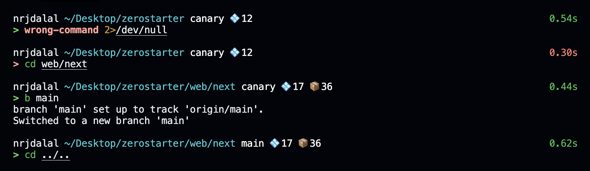

# Zshify

<!--  -->

**A minimalistic touch to your Zsh prompt!**

📦 `Zero dependencies` / `One command install` / `Fast and lightweight`

[](https://twitter.com/nrjdalal_dev)
[](https://github.com/nrjdalal/zshify)

> #### A minimalistic, one command installation to customize your Zsh prompt with colors, git info, and useful functions.



---

## Table of Contents

- [Quick Start](#-quick-start)
- [Features](#-features)
- [Advanced Experience](#-advanced-experience)
- [What's Included](#-whats-included)
  - [Prompt](#prompt)
  - [Additional Tools](#additional-tools)
- [Functions](#️-functions)
  - [File & Directory](#file--directory)
  - [Git Workflow](#git-workflow)
  - [Git Dangerous](#git-dangerous-with-confirmation)
  - [GitHub & Project Setup](#github--project-setup)
- [Aliases](#️-aliases)
- [Enhancements](#️-enhancements)
- [Background Tasks](#-background-tasks)
- [User Config](#-user-config)
- [Uninstall](#-uninstall)

---

## 🚀 Quick Start

```zsh
npx zshify
```

or

```zsh
/bin/zsh -c "$(curl -fsSL https://raw.githubusercontent.com/nrjdalal/zshify/refs/heads/main/bin/script.zsh)"
```

Yeah that's it, no downloads, no hassle. A minimalistic installation for a minimalistic package.

---

## 🔥 Features

- 🎨 Minimal, informative prompt with colors
- 🔀 Git branch, ahead/behind counts, and stash count
- 📦 Package dependency counts for Node.js projects
- ⏱️ Command execution time
- 📁 Useful [file and directory functions](#file--directory)
- 🛠️ [Git workflow shortcuts](#git-workflow) with safety guards

---

## 📖 Advanced Experience

To enrich your terminal experience, install these tools via [Homebrew](https://brew.sh):

```zsh
brew install \
  bat btop fd fzf ripgrep zoxide \         # recommended tools
  zsh-autosuggestions \                    # fish-like suggestions
  zsh-history-substring-search \           # history search with up/down
  zsh-syntax-highlighting                  # command highlighting
```

---

## 🔍 What's Included

### Prompt

```
┌─ username
│        ┌─ current directory
│        │         ┌─ git branch
│        │         │
nrjdalal ~/project main 💠3 📦5 ↑1 ↓2 ≡1                     0.123s
>                        │  │   │  │  │                        │
                         │  │   │  │  └─ stash count           └─ elapsed time
                         │  │   │  └─ behind remote
                         │  │   └─ ahead of remote
                         │  └─ dependencies
                         └─ devDependencies
```

### Additional Tools

These are available when installed via the [brew command above](#-advanced-experience):

| Command        | Description                                                                                 |
| -------------- | ------------------------------------------------------------------------------------------- |
| `btop`         | interactive system monitor — [btop](https://github.com/aristocratos/btop)                   |
| `cat <file>`   | syntax-highlighted output — [bat](https://github.com/sharkdp/bat)                           |
| `fd <pattern>` | fast file search, respects `.gitignore` — [fd](https://github.com/sharkdp/fd)               |
| `fzf`          | interactive fuzzy finder (`Ctrl+T`, `Alt+C`) — [fzf](https://github.com/junegunn/fzf)       |
| `rg <pattern>` | fast text search in files — [ripgrep](https://github.com/BurntSushi/ripgrep)                |
| `z <dir>`      | smart cd that learns frequent directories — [zoxide](https://github.com/ajeetdsouza/zoxide) |

---

## 🛠️ Functions

### File & Directory

| Command                 | Description                                                       |
| ----------------------- | ----------------------------------------------------------------- |
| `cdx <dir>`             | create a directory and cd into it                                 |
| `killport <port\|name>` | kill processes by port or name                                    |
| `ls`                    | show hidden files with color and sorting when called without args |
| `rename <name>`         | rename current or existing directory                              |
| `rm`                    | clear directory contents with safeguards for home/desktop         |

### Git Workflow

| Command        | Description                                    |
| -------------- | ---------------------------------------------- |
| `b <branch>`   | switch to, track, or create a git branch       |
| `g "message"`  | add, commit with conventional prefix, and push |
| `ga`           | stage all changes                              |
| `gc "message"` | commit with auto-prefixed message              |
| `pop [name]`   | pop latest stash or pop by name                |
| `stash [name]` | stash changes or list stashes if clean         |
| `unstash`      | list and clear all stashes                     |

### Git Dangerous (with confirmation)

| Command       | Description                                |
| ------------- | ------------------------------------------ |
| `git-main`    | migrate default branch from master to main |
| `only-commit` | squash all history into a single commit    |
| `reset [ref]` | hard reset and force push                  |
| `undo`        | discard last commit and force push         |

### GitHub & Project Setup

| Command             | Description                                                   |
| ------------------- | ------------------------------------------------------------- |
| `clone <repo>`      | clone a GitHub repository via [`gh`](https://cli.github.com)  |
| `mkrepo [--public]` | init repo, commit, and create GitHub repository               |
| `next`              | scaffold a Next.js project from template                      |
| `switch [account]`  | switch GitHub account via [`gh auth`](https://cli.github.com) |

---

## ⌨️ Aliases

| Alias                   | Command              |
| ----------------------- | -------------------- |
| `add`                   | `ga`                 |
| `c`                     | `cursor .`           |
| `commit`                | `gc`                 |
| `cr`                    | `cursor -r .`        |
| `mkcd`                  | `cdx`                |
| `showdesk` / `hidedesk` | toggle desktop icons |
| `trash`                 | `rm`                 |

---

## ⚙️ Enhancements

- `git` is wrapped to prevent accidental operations in `$HOME` or `~/Desktop`
- `git checkout -b <branch>` auto-switches if the branch already exists
- `npm` and `npx` are aliased to [`bun`](https://bun.sh) and `bunx` when bun is available (use `--real` to bypass)

---

## 🔄 Background Tasks

Zshify runs a daily background task (via `background.zsh`) that:

- Executes the profile setup script (`profile.zsh`)
- Logs activity to `~/.logs/.brewlog`
- View logs with `brewlog`, clear with `brewlog clear`

---

## 👤 User Config

Add your personal configuration to `~/.zshify/config/user.zsh` — it's sourced last and won't be overwritten on updates.

---

## 🗑️ Uninstall

**Soft uninstall** — remove from shell but keep files (preserves `user.zsh` config):

```zsh
sed -i '' '/source ~\/.zshify\/config\//d' ~/.zshrc && exec zsh
```

**Hard uninstall** — remove everything:

```zsh
sed -i '' '/source ~\/.zshify\/config\//d' ~/.zshrc && rm -rf ~/.zshify && exec zsh
```
